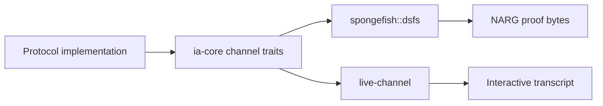

# Architecture Overview

Argus separates protocol logic from execution mechanics.

Protocol crates implement public-coin interactive protocols against the small
channel API in `ia-core`. Backend crates decide how the same protocol program is
executed:

- `spongefish::dsfs` compiles the protocol into a non-interactive argument or
  reduction using Duplex-Sponge Fiat-Shamir.
- `live-channel` runs the protocol interactively with verifier challenges sent
  over channels.

The important boundary is that protocol code never owns transcript state. It
sends prover messages, reads verifier challenges, and returns verifier results.
Absorption, challenge derivation, domain separation, replay, and proof byte
layout are backend responsibilities.

## Workspace Map

- `crates/ia-core`: channel traits, IA/IR traits, NARG vocabulary, composition,
  and security metadata.
- `crates/live-channel`: interactive backend using threads and `mpsc`.
- `crates/warp`: WARP as an interactive reduction plus a final argument.
- `crates/sigma-bridge`: compatibility layer for `sigma-proofs` protocols.
- `crates/argus-examples`: runnable examples and small protocol demos.
- `crates/ibcs`: work in progress for IOP-to-IA compilation.

The DSFS backend currently lives in the local `spongefish` dependency, exposed as
`spongefish::dsfs`.

## Data Flow

This split is what lets a protocol such as Schnorr, sumcheck, or WARP be written
once and then used non-interactively or interactively.

## Security Layer

Security metadata is opt-in. Protocols that expose formal bounds implement
`ArgumentSecurity` or `ReductionSecurity`. These traits are instance-aware: they
evaluate a `SecurityProfile` from a concrete instance, or from an explicit bound
describing a family of instances.

See [Instance-Aware Security](../security/instance-aware-security.md) for the
current API.
