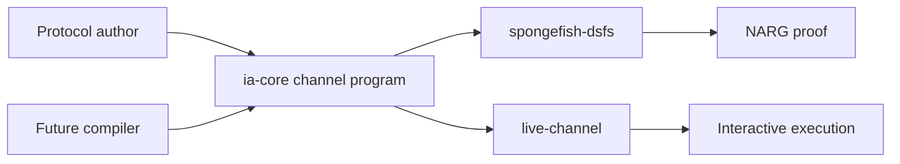

# Architecture Overview

Argus separates protocol logic from execution mechanics.

A protocol implementation describes a public-coin conversation against the
channel traits in `ia-core`. A backend then executes that conversation. The same
protocol object can be:

- compiled by `spongefish-dsfs` into a non-interactive proof,
- run by `live-channel` as an interactive protocol, or
- produced by a future compiler that lowers a richer formalism into an IA/IR
  channel program.

That last point matters. Argus is not only an input interface for DSFS. The IA
layer is also intended to be a target interface, for example in a future
pipeline shaped like `IOP + commitment scheme -> IA -> NARG`.

## Boundary

Protocol code owns the mathematical conversation:

- prover messages,
- verifier public coins,
- verifier checks,
- reduction outputs.

Backend code owns transcript mechanics:

- public-input absorption,
- committed-index binding for preprocessing protocols,
- sponge choice,
- prover-message absorption,
- challenge derivation,
- proof serialization,
- deterministic verifier replay.

No protocol implementation should instantiate a sponge, call transcript methods,
or derive Fiat-Shamir challenges directly.

## Workspace Map

- `crates/ia-core`: channel traits, protocol traits, preprocessing traits,
  composition, non-interactive vocabulary, and security metadata.
- `spongefish-dsfs`: DSFS compiler backend from IA/IR to NARG.
- `crates/live-channel`: interactive backend using threads and `mpsc`.
- `crates/argus-examples`: small runnable protocols.
- `crates/warp`: WARP as preprocessing reductions plus a final argument.
- `crates/sigma-bridge`: compatibility bridge for selected `sigma-proofs`
  layouts.

## Flow

Preprocessing protocols use the same boundary. Setup derives a prover key and a
verifier key; the DSFS wrapper stores neither. During proving and verification
the caller supplies the relevant key, and the backend binds the corresponding
committed-index bytes before the first challenge.

## Security Layer

Security metadata is separate from execution. Protocols that expose formal
bounds implement the security traits in `ia-core`; backends consume those
profiles to evaluate DSFS security bounds. The transcript invariants remain
backend requirements, not protocol-author responsibilities.
