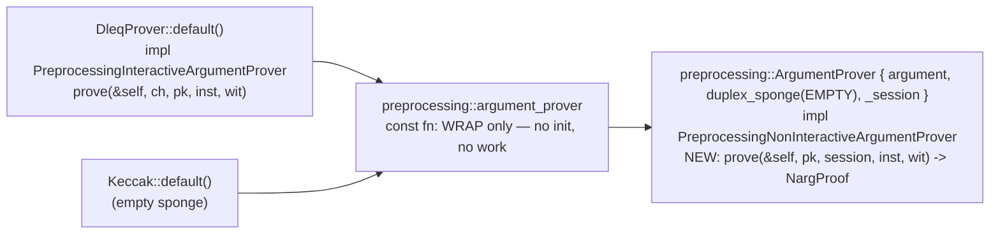
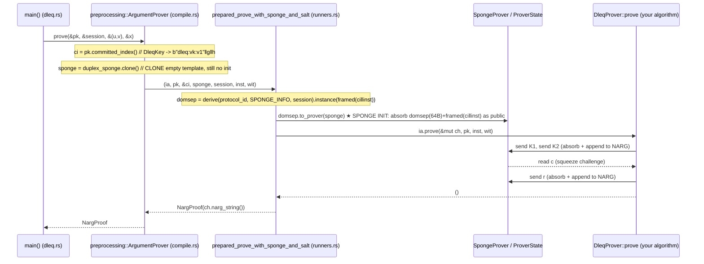

# DSFS: compile, then prove (DLEQ walkthrough)

This traces what actually happens when an application (`dleq`) takes an
interactive prover, **compiles** it through DSFS, and then **proves**. It answers
four questions:

1. What crosses into the DSFS layer at compile time?
2. What does "compile" actually do (sponge init? wrapping?)?
3. What object comes back, and what new API does the app gain?
4. What is the call stack / data flow when the app calls `.prove`?

## The naming, decoded first

The word `prove` appears at three layers and the trait names differ by one buried
word. This is the whole source of confusion:

| Name | What it really is | Implemented by |
| --- | --- | --- |
| `Preprocessing`**`Interactive`**`ArgumentProver` | **the algorithm** you write; needs a channel | `DleqProver` (your code) |
| `Preprocessing`**`NonInteractive`**`ArgumentProver` | **the compiled NIZK**; "give me bytes" | `preprocessing::ArgumentProver` (DSFS) |
| `preprocessing::ArgumentProver` | the wrapper struct that bridges the two | DSFS |
| `ia` (inside the runner) = `self.argument` | the algorithm object, i.e. your `DleqProver` | — |

`Interactive` = what you author. `NonInteractive` = what DSFS hands back. The
compiled one *calls* yours.

---

## Phase 1 — Compile

```rust,ignore
let prover = dsfs::preprocessing::argument_prover::<_, [u8; 64], _>(
    DleqProver::<G>::default(),   // the interactive algorithm (a ZST)
    dsfs::Keccak::default(),      // an EMPTY sponge — the sponge choice
);
```

### 1. What crosses into DSFS

Exactly **two values** plus **one type**:

- `DleqProver::default()` — the algorithm object. It implements
  `PreprocessingInteractiveArgumentProver`, which declares:
  - `protocol_id() -> "dleq-chaum-pedersen"`
  - `type Instance = (G, G)`, `type Witness = F`, `type ProverKey = DleqKey`
  - `prove(&self, ch, pk, inst, wit)` — note it needs a **channel** `ch`.
- `Keccak::default()` — an empty sponge value (the sponge *choice*).
- `Session = [u8; 64]` — a type parameter (here inferred from `session!`).

That is all DSFS ever sees of the protocol.

### 2. What "compile" means

`preprocessing::argument_prover` is a **`const fn`**. It does **no
work**: it does not run the protocol, does not derive a domain separator, and
**does not initialise the sponge**. It just moves the two values into one struct:

```rust,ignore
// crates' view of what gets built (spongefish-dsfs/src/compile.rs)
preprocessing::ArgumentProver {
    argument:      DleqProver,            // your algorithm, stored as-is
    duplex_sponge: Keccak,                // the EMPTY template; init deferred to .prove
    _session:      PhantomData<[u8; 64]>,
}
```

The stored sponge is a **template**: empty, immutable, reused across every proof.

### 3. What you get back + the new API

`prover` now implements `PreprocessingNonInteractiveArgumentProver`, so the app
gains a channel-free method that returns a proof artifact:

```rust,ignore
// NEW API (no `ch`, returns bytes)
prove(&self, pk: &DleqKey, session: &[u8; 64], inst: &(G, G), wit: &F) -> NargProof
```

The verifier compiles the same way into `preprocessing::ArgumentVerifier`, giving:

```rust,ignore
verify(&self, vk: &DleqKey, session: &[u8; 64], inst: &(G, G), proof: &NargProof)
    -> VerificationResult<()>
```

Keys (`pk` / `vk`) are **not** stored in the compiled object — they are passed as
arguments on every call.



---

## Phase 2 — Prove

```rust,ignore
let proof = prover.prove(&pk, &session, &(u, v), &x);   // -> NargProof
```

This is where the sponge wakes up. The compiled object is borrowed `&self` and is
never mutated; a fresh transcript is created and destroyed inside the call.



Step by step, with the data each layer adds:

1. **`preprocessing::ArgumentProver::prove`** (`compile.rs`)
   - `ci = pk.committed_index()` — derives the index commitment bytes from the key.
   - `sponge = self.duplex_sponge.clone()` — clones the **empty** template; still no init.
   - delegates to the runner with `(ia = &self.argument, pk, &ci, sponge, session, inst, wit)`.

2. **`prepared_prove_with_sponge_and_salt`** (`runners.rs`)
   - `domsep = derive(protocol_id, SPONGE_INFO, session).instance(framed(ci ‖ inst))`.
   - `ProverState = domsep.to_prover(sponge)` — **★ the sponge is initialised here**:
     it absorbs the 64-byte domain tag and the tagged, length-framed `(ci ‖ inst)`
     as public messages, before any challenge.
   - wraps it as `ch = SpongeProver { state }` (salt is empty here: `SALT_LEN = 0`).
   - calls `ia.prove(&mut ch, pk, inst, wit)` — **inversion of control**: DSFS now
     drives your algorithm.

3. **`DleqProver::prove`** (`dleq.rs`) — *your* algorithm
   - `k = rand; ch.send(K1); ch.send(K2); c = ch.read(); ch.send(r)`.
   - talks **only** to `ch`; never sees a sponge. Each `send` absorbs the message
     and appends it to the NARG buffer; `read` squeezes the challenge. Returns `()`.

4. The runner snapshots the bytes: `NargProof::from_bytes(ch.narg_string())`, and the
   `ProverState` is dropped. The proof flows back up to `main()`.

Note the challenge `c` is **not** in the proof bytes — the verifier re-squeezes it
during replay. The proof is just `[K1 ‖ K2 ‖ r]`.

---

## Who owns what state

| Layer | File | State? |
| --- | --- | --- |
| `main` | `dleq.rs` | app data (keys, instances) — plain values, reused |
| `preprocessing::ArgumentProver` | `compile.rs` | **immutable** `&self`: ZST body + **empty sponge template** |
| `prepared_prove_with_sponge_and_salt` | `runners.rs` | none persistent — builds + drops the transcript |
| `DleqProver` | `dleq.rs` | **none** (ZST); only a local nonce `k` per call |
| `SpongeProver` | `channel.rs` | borrows the transcript; no own state |
| `ProverState` | `narg_prover.rs` | **the real state** (sponge + NARG buffer + RNG) — lives one call |

---

## Takeaways

- **Compile** is a cheap `const fn` wrap. The sponge goes in **empty** and stays
  dormant; no domain separation, no absorption happens at compile time.
- **The new API** swaps the interactive `prove(&self, ch, …)` for the compiled
  `prove(&self, pk, session, inst, wit) -> NargProof` (and the verifier mirror).
- **Prove** clones the template, *then* initialises a one-shot transcript, runs your
  algorithm through a channel, snapshots the NARG bytes, and destroys the transcript.
- The compiled object is immutable across calls; **keys are arguments, not state**;
  nothing carries over between proofs.
