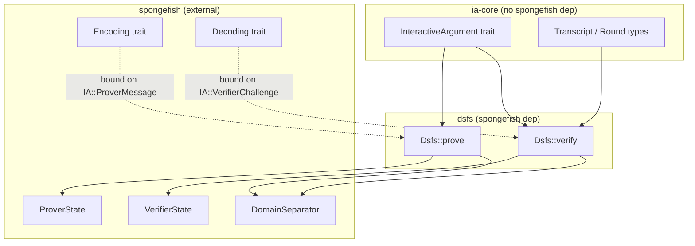

# IARG Interface -- First Iteration

## Architecture



The key insight: spongefish already handles sponge init / absorb / squeeze / salt (via `DomainSeparator`, `ProverState`, `VerifierState`). DSFS is an **orchestrator** that drives the IA round-by-round, piping messages through spongefish. No sponge logic is reimplemented.

---

## 1. ia-core: `InteractiveArgument` trait + supporting types

File: [`crates/ia-core/src/lib.rs`](../crates/ia-core/src/lib.rs)

```rust
#![no_std]
extern crate alloc;
use alloc::vec::Vec;

/// A single round of interaction: prover message followed by verifier challenge.
pub struct Round<M, C> {
    pub message: M,
    pub challenge: C,
}

/// Full transcript of an interactive argument (k rounds).
pub struct Transcript<M, C> {
    pub rounds: Vec<Round<M, C>>,
}

/// A public-coin interactive argument (Construction 4.3).
///
/// Describes WHAT the protocol does. DSFS handles HOW Fiat-Shamir is applied.
pub trait InteractiveArgument {
    type Instance;
    type Witness;
    type ProverState;
    type ProverMessage;
    type VerifierChallenge;

    /// Unique 64-byte protocol identifier for domain separation.
    fn protocol_id() -> [u8; 64];

    /// Number of interaction rounds k, determined by the instance.
    fn num_rounds(instance: &Self::Instance) -> usize;

    /// Initialize mutable prover state from instance + witness.
    fn prover_init(
        instance: &Self::Instance,
        witness: &Self::Witness,
    ) -> Self::ProverState;

    /// Produce the prover message for the current round.
    /// `challenge` is None for round 0, Some(rho_{i-1}) for round i > 0.
    /// The prover state advances internally.
    fn prover_round(
        state: &mut Self::ProverState,
        challenge: Option<&Self::VerifierChallenge>,
    ) -> Self::ProverMessage;

    /// Verification predicate V(x, a_1, rho_1, ..., a_k, rho_k) -> accept/reject.
    fn verify(
        instance: &Self::Instance,
        transcript: &Transcript<Self::ProverMessage, Self::VerifierChallenge>,
    ) -> bool;
}
```

### Dependency changes for ia-core

Strip to minimal: remove `ark-crypto-primitives`, `ark-serialize`, `ark-std`. The IA trait itself needs nothing beyond `alloc`. Protocol implementations (e.g. in ibcs or examples) bring their own deps.

---

## 2. dsfs: DSFS orchestrator

File: [`crates/dsfs/src/lib.rs`](../crates/dsfs/src/lib.rs)

The DSFS layer adds spongefish trait bounds on the IA's associated types and drives the protocol:

```rust
extern crate alloc;
use alloc::vec::Vec;
use ia_core::{InteractiveArgument, Round, Transcript};
use spongefish::{
    DomainSeparator, Encoding, Decoding,
    NargSerialize, NargDeserialize,
    VerificationResult, VerificationError,
};
```

### Prove flow (matches Construction 4.3 exactly)

```
DSFS.prove(session, instance, witness):
  sponge = DomainSeparator(IA::protocol_id(), session, instance).std_prover()
  state  = IA::prover_init(instance, witness)
  challenge = None
  for round in 0..k:
    msg = IA::prover_round(&mut state, challenge)
    sponge.prover_message(&msg)        // encode + absorb + serialize
    challenge = sponge.verifier_message()  // squeeze + decode
  return sponge.narg_string()
```

### Verify flow (deterministic replay)

```
DSFS.verify(session, instance, proof):
  sponge = DomainSeparator(IA::protocol_id(), session, instance).std_verifier(proof)
  for round in 0..k:
    msg = sponge.prover_message()          // deserialize + absorb
    challenge = sponge.verifier_message()  // squeeze + decode
    rounds.push(Round { msg, challenge })
  sponge.check_eof()?
  IA::verify(instance, &Transcript { rounds }) -> accept/reject
```

### Where spongefish traits are enforced (not in ia-core)

- `IA::Instance: Encoding` -- for absorbing the instance into the sponge
- `IA::ProverMessage: Encoding + NargSerialize + NargDeserialize` -- the paper's phi_i
- `IA::VerifierChallenge: Decoding` -- the paper's psi_i

These bounds live on the DSFS `prove`/`verify` functions, keeping ia-core clean.

---

## 3. Design mapping

| Concept                       | Implementation                                                          |
| ----------------------------- | ----------------------------------------------------------------------- |
| **IA description**            | `InteractiveArgument` trait in ia-core                                  |
| **Codec**                     | Spongefish `Encoding`/`Decoding` trait bounds on DSFS functions         |
| **Prover state**              | `IA::ProverState` associated type                                       |
| **Verifier transcript state** | Internal to DSFS replay (builds `Transcript` for IA::verify)            |
| **DSFS transcript engine**    | `prove`/`verify` free functions in dsfs crate                           |
| **init_sponge + absorb_salt** | `DomainSeparator::new().session().instance()` (spongefish handles this) |
| **absorb_message**            | `sponge.prover_message()`                                               |
| **squeeze_challenge**         | `sponge.verifier_message()`                                             |

---

## 4. Design decisions

- **Strict k-round model**: every prover message gets a challenge. Multi-phase protocols (commit + sumcheck + opening) bundle phases into round messages using an enum `ProverMessage` type. This matches Construction 4.3 exactly.
- **No separate Codec object**: spongefish's `Encoding`/`Decoding` already implement the paper's (phi_i, psi_i). DSFS enforces these as trait bounds.
- **ia-core has zero spongefish dependency**: the IA trait is protocol-pure. DSFS is the sole bridge to the sponge (per CRYPTO_INVARIANTS rule 10).
- **DSFS owns the full sponge lifecycle**: protocol_id, session, instance absorption, round driving, narg serialization. IA never touches the sponge.
- **`verify` returns `bool`**: the IA is a pure predicate. DSFS maps `false` to `Err(VerificationError)`.

---

## 5. Committed sumcheck mapping (for validation)

To fit the strict k-round model, the committed sumcheck would use an enum:

```rust
enum SumcheckMsg {
    CommitAndFirst { root: Bytes, s0: Fr, s1: Fr },
    Middle { s0: Fr, s1: Fr },
    Opening(OpeningProof),
}
```

- `num_rounds = n + 1` (n sumcheck rounds, 1 opening round)
- Round 0: `CommitAndFirst` (root bundled with first s0/s1)
- Rounds 1..n-1: `Middle`
- Round n: `Opening` (challenge from this round is unused by verify)

This keeps the strict alternation: absorb, squeeze, absorb, squeeze, ..., and the IA verifier ignores the last challenge.
