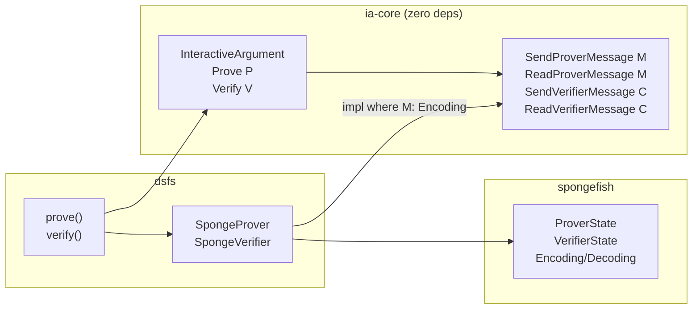

# IA v2: Zero-Dep Channel Abstraction

## Motivation

v1 forced protocol authors into a state-machine pattern: a single `ProverMessage` enum with round-counter dispatch, and a single `VerifierChallenge` type for all rounds. Feedback from Michele Orru and Alessandro Chiesa identified several issues:

- **Enum dispatch problem** (Michele): `prover_round` acts as a dispatcher across rounds, requiring a big enum and match syntax. A channel abstraction with linear code would be better.
- **Heterogeneous verifier messages** (Chiesa): v1 had a single `type VerifierChallenge` associated type, so all rounds shared one challenge type. Real protocols may need different challenge types per round (e.g., bit challenges in some rounds, field element challenges in others).
- **Instance must be encodable** (Michele): the instance needs to be absorbed into the sponge for domain separation. v2 enforces this via `IA::Instance: Encoding<[u8]>` at the dsfs layer.
- **Protocol ID should contain ciphersuite info** (Michele): the protocol identifier is for the non-interactive argument and must include the ciphersuite used to instantiate the random oracle. Currently the IA provides the protocol name; extending it with ciphersuite info at the DSFS level is planned as a future refinement.
- **"Verifier challenge" should be "verifier message"** (Michele): the terminology in spongefish and the paper uses "verifier message," not "verifier challenge." Renamed throughout: `SendVerifierMessage`, `ReadVerifierMessage`, `send_verifier_message`, `read_verifier_message`.

## Core Insight

Channel traits are parameterized over message types with **no bounds** on the type parameter. Bounds go on the **impl side only**. This keeps ia-core free of spongefish while preserving fully-typed, linear protocol code.

Both prover messages and verifier messages support **heterogeneous types per round**. A protocol can send `G` in round 1, `Fr` in round 2, and squeeze `u8` challenges in some rounds and `Fr` challenges in others -- all through the same channel, disambiguated by Rust's type inference.



## ia-core: [ia-core/src/lib.rs](crates/ia-core/src/lib.rs)

Zero external dependencies. Defines:

- **Error types**: `VerificationError`, `VerificationResult<T>`
- **Channel traits** (all parameterized, zero bounds on M/C):
  - `SendProverMessage<M>` -- prover sends a message: `fn send_prover_message(&mut self, msg: &M)`
  - `ReadProverMessage<M>` -- verifier reads a message from proof: `fn read_prover_message(&mut self) -> VerificationResult<M>`
  - `SendVerifierMessage<C>` -- verifier produces a challenge: `fn send_verifier_message(&mut self) -> C`
  - `ReadVerifierMessage<C>` -- prover receives a challenge: `fn read_verifier_message(&mut self) -> C`
- **IA traits**:
  - `InteractiveArgument` -- metadata: `Instance`, `Witness`, `protocol_id()`
  - `Prove<P>: InteractiveArgument` -- prover logic against an abstract channel P
  - `Verify<V>: InteractiveArgument` -- verifier logic against an abstract channel V

`Prove` and `Verify` are separate traits (not combined with channel type params on `InteractiveArgument`) so that `dsfs::prove` only requires `Prove<SpongeProver>` and `dsfs::verify` only requires `Verify<SpongeVerifier<'a>>` -- no unused type parameters, no lifetime gymnastics.

### Heterogeneous message types

Because the channel traits are parameterized per type, a protocol can stack multiple types in a single where clause:

```rust
P: SendProverMessage<G>              // round 1: send group element
    + ReadVerifierMessage<Fr>          // round 1: receive field challenge
    + SendProverMessage<Fr>           // round 2: send field element
    + ReadVerifierMessage<u8>          // round 2: receive bit challenge
```

Rust dispatches to the correct trait impl based on the type annotation at each call site. No enums, no tags, no round counters.

## dsfs: [dsfs/src/lib.rs](crates/dsfs/src/lib.rs)

Wraps spongefish's `ProverState` and `VerifierState` behind ia-core's channel traits:

- `SpongeProver` -- wraps `ProverState`
  - `impl<M: Encoding<[u8]>> SendProverMessage<M>` -- calls `state.prover_message(msg)` (absorb + serialize to NARG)
  - `impl<C: Decoding<[u8]>> ReadVerifierMessage<C>` -- calls `state.verifier_message()` (squeeze)
- `SpongeVerifier<'a>` -- wraps `VerifierState<'a>`
  - `impl<M: Encoding<[u8]> + NargDeserialize> ReadProverMessage<M>` -- calls `state.prover_message()` (deserialize from NARG + absorb)
  - `impl<C: Decoding<[u8]>> SendVerifierMessage<C>` -- calls `state.verifier_message()` (squeeze)
- `prove<IA>()` -- creates `DomainSeparator` + `SpongeProver`, calls `IA::prove`, extracts NARG
  - Bound: `IA: Prove<SpongeProver>, IA::Instance: Encoding<[u8]>`
- `verify<'a, IA>()` -- creates `DomainSeparator` + `SpongeVerifier`, calls `IA::verify`, checks EOF
  - Bound: `IA: Verify<SpongeVerifier<'a>>, IA::Instance: Encoding<[u8]>`
  - Returns `ia_core::VerificationResult<()>`, converting spongefish errors

## Examples

### Schnorr: [schnorr.rs](crates/argus-examples/src/bin/schnorr.rs)

Single prover message type (`G`, `G::ScalarField`) and single challenge type (`G::ScalarField`). Demonstrates the basic channel pattern with zero codec boilerplate -- all types have built-in spongefish support.

### Committed Sumcheck: [sumcheck_commit.rs](crates/argus-examples/src/bin/sumcheck_commit.rs)

Multiple prover message types (`Bytes` for Merkle root, `Fr` for partial sums, `OpeningProof` for the opening) and `u8` bit challenges. Demonstrates heterogeneous message types and custom codec types (`Bytes`, `OpeningProof` with spongefish derive macros) flowing through the same abstract channel.

## Key properties

- **ia-core has zero external dependencies** -- channel traits use bare type parameters
- **Spongefish bounds live exclusively in dsfs impl blocks** -- via conditional implementations like `impl<M: Encoding> SendProverMessage<M> for SpongeProver`
- **Heterogeneous messages and challenges** -- different types per round, disambiguated by Rust's type inference (no enums needed for either prover messages or verifier messages)
- **Instance is encodable** -- enforced at the dsfs layer via `IA::Instance: Encoding<[u8]>`
- **Protocol code is linear and typed** -- `ch.send_prover_message(&commitment)` then `ch.read_verifier_message()` then `ch.send_prover_message(&response)`
- **Channel is modular** -- swap SpongeProver for a NetworkChannel that uses serde, async I/O, etc.

## Open items

- **Protocol ID / ciphersuite**: the protocol identifier should contain information about the ciphersuite used to instantiate the random oracle (e.g., which hash function). Currently the IA provides only the protocol name; the DSFS layer should extend it with ciphersuite info when building the `DomainSeparator`.
