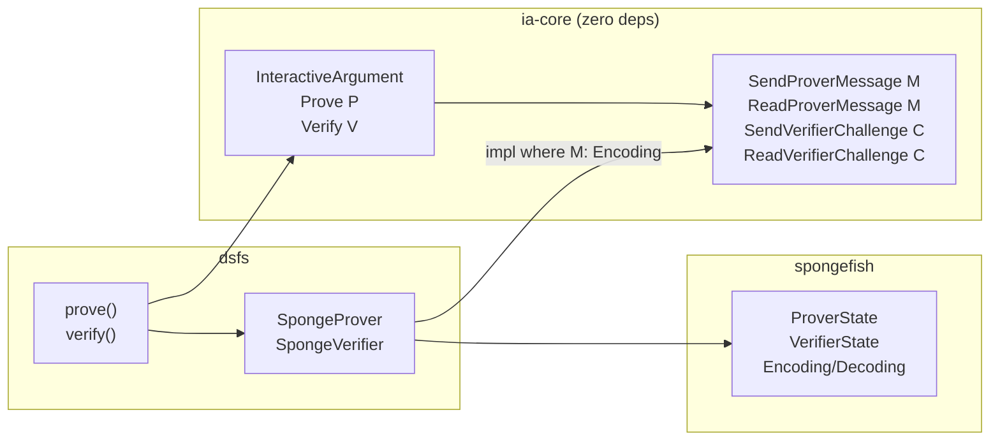

# IA v2: Zero-Dep Channel Abstraction

## Core Insight

Channel traits are parameterized over message types with **no bounds** on the type parameter. Bounds go on the **impl side only**. This keeps ia-core free of spongefish while preserving fully-typed, linear protocol code.

## ia-core: [ia-core/src/lib.rs](crates/ia-core/src/lib.rs) -- complete rewrite

Zero external dependencies. Defines:

- **Error types**: `VerificationError`, `VerificationResult<T>`
- **Channel traits** (all parameterized, zero bounds on M/C):
  - `SendProverMessage<M>` -- prover sends a message: `fn send_prover_message(&mut self, msg: &M)`
  - `ReadProverMessage<M>` -- verifier reads a message from proof: `fn read_prover_message(&mut self) -> VerificationResult<M>`
  - `SendVerifierChallenge<C>` -- verifier produces a challenge: `fn send_verifier_challenge(&mut self) -> C`
  - `ReadVerifierChallenge<C>` -- prover receives a challenge: `fn read_verifier_challenge(&mut self) -> C`
- **IA traits**:
  - `InteractiveArgument` -- metadata: `Instance`, `Witness`, `protocol_id()`
  - `Prove
: InteractiveArgument` -- prover logic against an abstract channel P
  - `Verify<V>: InteractiveArgument` -- verifier logic against an abstract channel V

`Prove` and `Verify` are separate traits (not combined with channel type params on `InteractiveArgument`) so that `dsfs::prove` only requires `Prove<SpongeProver>` and `dsfs::verify` only requires `Verify<SpongeVerifier<'a>>` -- no unused type parameters, no lifetime gymnastics.

Cargo.toml: **no changes** (stays zero deps).

## dsfs: [dsfs/src/lib.rs](crates/dsfs/src/lib.rs) -- complete rewrite

Wraps spongefish's `ProverState` and `VerifierState` behind ia-core's channel traits:

- `SpongeProver` -- wraps `ProverState`
  - `impl<M: Encoding<[u8]>> SendProverMessage<M>` -- calls `state.prover_message(msg)` (absorb + serialize to NARG)
  - `impl<C: Decoding<[u8]>> ReadVerifierChallenge<C>` -- calls `state.verifier_message()` (squeeze)
- `SpongeVerifier<'a>` -- wraps `VerifierState<'a>`
  - `impl<M: Encoding<[u8]> + NargDeserialize> ReadProverMessage<M>` -- calls `state.prover_message()` (deserialize from NARG + absorb)
  - `impl<C: Decoding<[u8]>> SendVerifierChallenge<C>` -- calls `state.verifier_message()` (squeeze)
- `prove<IA>()` -- creates `DomainSeparator` + `SpongeProver`, calls `IA::prove`, extracts NARG
  - Bound: `IA: Prove<SpongeProver>, IA::Instance: Encoding<[u8]>`
- `verify<'a, IA>()` -- creates `DomainSeparator` + `SpongeVerifier`, calls `IA::verify`, checks EOF
  - Bound: `IA: Verify<SpongeVerifier<'a>>, IA::Instance: Encoding<[u8]>`
  - Returns `ia_core::VerificationResult<()>`, converting spongefish errors

Cargo.toml: **no changes** (stays `ia-core` + `spongefish`).

## Schnorr example: [argus-examples/src/bin/schnorr.rs](crates/argus-examples/src/bin/schnorr.rs) -- complete rewrite

**Delete entirely**: `SchnorrMsg` enum, `SchnorrProverState`, `canonical_bytes()` helper, all `Encoding`/`NargDeserialize` impl blocks.

What remains (~100 lines total):

- `struct Schnorr<G>`
- `impl InteractiveArgument` -- just Instance/Witness/protocol_id
- `impl
 Prove
` where `P: SendProverMessage<G> + SendProverMessage<G::ScalarField> + ReadVerifierChallenge<G::ScalarField>` -- 5 lines of linear code: compute commitment, send it, get challenge, compute response, send it
- `impl<V> Verify<V>` where `V: ReadProverMessage<G> + ReadProverMessage<G::ScalarField> + SendVerifierChallenge<G::ScalarField>` -- 5 lines: read commitment, derive challenge, read response, check equation
- `main()` -- calls `dsfs::prove` and `dsfs::verify` (unchanged)

No `ark-serialize` imports needed. No spongefish codec imports. The protocol code only uses ia-core channel traits.

## Key properties

- **ia-core has zero external dependencies** -- channel traits use bare type parameters
- **Spongefish bounds live exclusively in dsfs impl blocks** -- via conditional implementations like `impl<M: Encoding> SendProverMessage<M> for SpongeProver`
- **Protocol code is linear and typed** -- `ch.send_prover_message(&commitment)` then `ch.read_verifier_challenge()` then `ch.send_prover_message(&response)`
- **Channel is modular** -- swap SpongeProver for a NetworkChannel that uses serde, async I/O, etc.
- **No round counting, no enums, no manual codec** -- spongefish's built-in Encoding/Decoding/NargDeserialize for arkworks types handle everything

## Verification

After implementing, run `cargo check` and `cargo run --bin schnorr` to validate the full stack end-to-end.
