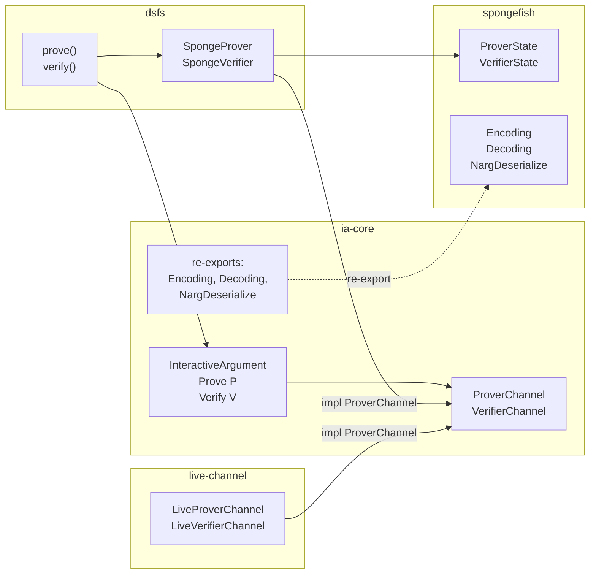

# IA v3: Method-Level Generics

## Motivation

v2 introduced a channel abstraction that replaced the state-machine pattern with linear protocol code. However, the channel traits used **trait-level generics**, which caused two problems identified by Michele Orru:

- **Bound explosion**: each distinct message type a protocol uses adds a separate trait bound to the channel parameter. Schnorr needed 3 bounds, committed sumcheck needed 4, and any complex protocol would need O(n) bounds where n is the number of message types.

  ```rust
  // v2: every message type is a separate bound on the channel
  P: SendProverMessage<G>
      + SendProverMessage<G::ScalarField>
      + ReadVerifierMessage<G::ScalarField>
  ```

- **4 traits for 2 roles**: `SendProverMessage`, `ReadProverMessage`, `SendVerifierMessage`, `ReadVerifierMessage` are 4 traits, but the prover only ever uses send + read-challenge, and the verifier only uses read + generate-challenge. Two traits suffice.

## Core change

Move the generic from the **trait** to the **method**. A channel implements the trait once; the method accepts any type satisfying the codec bound.

```rust
// v2: trait-level generic (one trait per message type)
pub trait SendProverMessage<PM> {
    fn send_prover_message(&mut self, msg: &PM);
}

// v3: method-level generic (one trait, any message type)
pub trait ProverChannel {
    fn send_prover_message<PM: Encoding>(&mut self, msg: &PM);
    fn read_verifier_message<VM: Decoding>(&mut self) -> VM;
}
```



## Tradeoff

v2's channel traits had **no bounds** on the type parameter. This kept ia-core free of external dependencies -- all spongefish-specific bounds lived on the dsfs impl side. v3 puts the codec bound (`Encoding`, `Decoding`) directly in the trait method signature, which requires ia-core to import these traits from spongefish.

**What we gained**: channel bounds collapse from O(n) to O(1). Protocols with concrete types (committed sumcheck, WARP accumulate) need no `where` clauses at all beyond `P: ProverChannel`.

**What we accepted**: ia-core depends on spongefish for three codec traits. These are pure serialization interfaces -- they define how types convert to/from bytes. No sponge operations (absorb, squeeze) enter ia-core. The architecture invariant "DSFS is the only place where sponge operations occur" is preserved.

**Why this is forced by Rust**: method-level generics require the bound to appear in the trait definition. Without `Encoding` in scope, no crate can write `fn send_prover_message<M: Encoding>`. The orphan rule prevents a third crate from bridging independently-defined codec traits with arkworks types -- spongefish's `Encoding`/`Decoding` already have implementations for arkworks types, so reusing them avoids reinventing that bridge.

**Future channel implementations**: ia-core does not need new dependencies to support additional channel backends. Any crate that depends on ia-core and spongefish can implement `ProverChannel`/`VerifierChannel`. The codec traits (`Encoding`, `Decoding`) become the shared serialization vocabulary for all channels.

## ia-core: [ia-core/src/lib.rs](../crates/ia-core/src/lib.rs)

Depends on spongefish (codec traits only). Defines:

- **Error types**: `VerificationError`, `VerificationResult<T>`
- **Re-exports**: `Encoding`, `Decoding`, `NargDeserialize` from spongefish
- **Channel traits** (method-level generics):
  - `ProverChannel` -- prover sends messages and reads challenges
    - `fn send_prover_message<PM: Encoding>(&mut self, msg: &PM)`
    - `fn read_verifier_message<VM: Decoding>(&mut self) -> VM`
  - `VerifierChannel` -- verifier reads messages and derives challenges
    - `fn read_prover_message<PM: Encoding + NargDeserialize>(&mut self) -> VerificationResult<PM>`
    - `fn send_verifier_message<VM: Decoding>(&mut self) -> VM`
- **IA traits**:
  - `InteractiveArgument` -- metadata: `Instance`, `Witness`, `protocol_id()`
  - `Prove<P: ProverChannel>` -- prover logic against a `ProverChannel`
  - `Verify<V: VerifierChannel>` -- verifier logic against a `VerifierChannel`
- **IOR traits**:
  - `InteractiveReduction` -- metadata: `SourceInstance`, `TargetInstance`, `Witness`, `protocol_id()`
  - `ReduceProve<P: ProverChannel>` -- prover logic for a reduction
  - `ReduceVerify<V: VerifierChannel>` -- verifier logic; returns a new instance, not accept/reject

## dsfs: [dsfs/src/lib.rs](../crates/dsfs/src/lib.rs)

Implements the channel traits once per channel type (not once per message type):

- `SpongeProver` implements `ProverChannel`
  - `send_prover_message` calls `state.prover_message(msg)` (absorb + serialize to NARG)
  - `read_verifier_message` calls `state.verifier_message()` (squeeze + decode)
- `SpongeVerifier<'a>` implements `VerifierChannel`
  - `read_prover_message` calls `state.prover_message()` (deserialize from NARG + absorb)
  - `send_verifier_message` calls `state.verifier_message()` (squeeze + decode)

Compiler functions unchanged in structure:
- `prove<IA>()` -- bound: `IA: Prove<SpongeProver>, IA::Instance: Encoding`
- `verify<'a, IA>()` -- bound: `IA: Verify<SpongeVerifier<'a>>, IA::Instance: Encoding`
- `prove_reduction<IR>()` / `verify_reduction<'a, IR>()` -- same pattern for IOR

## Bounds comparison

### Generic protocol (Schnorr)

```rust
// v2
P: SendProverMessage<G> + SendProverMessage<G::ScalarField>
    + ReadVerifierMessage<G::ScalarField>

// v3
G: CurveGroup + PrimeGroup + Encoding,
G::ScalarField: Encoding + Decoding,
P: ProverChannel,
```

The channel bound is always one trait. Type-level requirements (which types need `Encoding`/`Decoding`) are expressed on the types themselves.

### Concrete protocol (committed sumcheck, WARP accumulate)

```rust
// v2
P: SendProverMessage<Bytes> + SendProverMessage<Fr>
    + ReadVerifierMessage<u8> + SendProverMessage<OpeningProof>

// v3
impl<P: ProverChannel> Prove<P> for CommittedSumcheck {
    // no where clause needed -- all types are concrete with known impls
}
```

## Key properties

- **ia-core depends on spongefish for codec traits only** -- no sponge operations
- **2 channel traits** instead of 4 -- `ProverChannel` and `VerifierChannel`
- **Channel bounds are O(1)** -- always `P: ProverChannel` regardless of message count
- **Heterogeneous messages** -- different types per round, resolved at each call site by Rust's type inference
- **Channel is modular** -- two implementations exist: `dsfs::SpongeProver` (Fiat-Shamir) and `live_channel::LiveProverChannel` (truly interactive over mpsc)
- **Protocol code is linear and typed** -- `ch.send_prover_message(&K)` then `ch.read_verifier_message()` then `ch.send_prover_message(&r)`
- **Same protocol code runs both non-interactively and interactively** -- swap the channel, keep the protocol

## Open items

- **Protocol ID / ciphersuite**: the protocol identifier should contain ciphersuite information (which hash function). Currently the IA provides only the protocol name.
- **Shared protocol modules**: protocol definitions (Schnorr, etc.) are duplicated across example binaries. Extracting them to a shared module or library would allow both DSFS and live-channel examples to import the same code.
