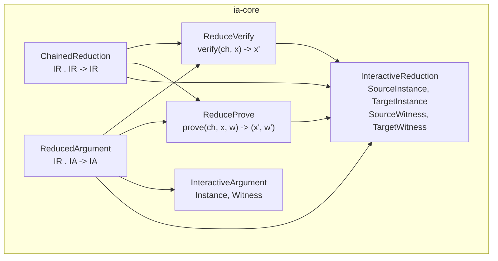

# Interactive Reduction v2: Source/Target Witness and Sequential Composition

## Motivation

The v1 IR interface had a single `Witness` type, and the prover returned nothing:

```rust
pub trait InteractiveReduction {
    type SourceInstance;
    type TargetInstance;
    type Witness;               // single witness
    fn protocol_id() -> [u8; 64];
}

pub trait ReduceProve<P: ProverChannel>: InteractiveReduction {
    fn prove(ch: &mut P, instance: &Self::SourceInstance, witness: &Self::Witness);
    //       ^^ returns ()
}
```

This models one reduction in isolation, but it cannot express sequential composition. Given two reductions (P1, V1) and (P2, V2), the composed prover needs to pass both the target witness **and** the target instance from the first reduction into the second:

```
P(x1, w1):                        V(x1):
  (x2, w2) = P1(x1, w1)   <->      x2 = V1(x1)
  (x3, w3) = P2(x2, w2)   <->      x3 = V2(x2)
  output (x3, w3)                   output x3
```

The verifier side is mechanical (run V1, feed x2 to V2). The prover side requires x2 -- which the v1 interface didn't expose.

## Key changes

### Split Witness into SourceWitness + TargetWitness

A reduction transforms one relation into another. The prover consumes a witness for the **source** relation and produces a witness for the **target** relation. These are distinct types:

```rust
pub trait InteractiveReduction {
    type SourceInstance;
    type TargetInstance;
    type SourceWitness;      // prover's input
    type TargetWitness;      // prover's output
    fn protocol_id() -> [u8; 64];
}
```

### Prover returns (TargetInstance, TargetWitness)

In a public-coin protocol, the prover sees the same transcript as the verifier. It can always compute the target instance as a side-effect of its own execution. Returning it enables automatic composition:

```rust
pub trait ReduceProve<P: ProverChannel>: InteractiveReduction {
    fn prove(
        ch: &mut P,
        instance: &Self::SourceInstance,
        witness: &Self::SourceWitness,
    ) -> (Self::TargetInstance, Self::TargetWitness);
}
```

The DSFS compiler discards both returned values -- it only needs the NARG string from the sponge. The returned pair exists solely so composed provers can thread the intermediate instance and witness into the next stage.

### ReduceVerify unchanged

```rust
pub trait ReduceVerify<V: VerifierChannel>: InteractiveReduction {
    fn verify(
        ch: &mut V,
        instance: &Self::SourceInstance,
    ) -> VerificationResult<Self::TargetInstance>;
}
```

## Sequential Composition

Two composition structs auto-implement both prover and verifier. Illegal compositions are statically forbidden by the type system (no trait impls exist for them).

| Composition | Struct | Output |
|---|---|---|
| IR . IR | `ChainedReduction<First, Second>` | IR |
| IR . IA | `ReducedArgument<Reduction, Argument>` | IA |
| IA . IR | -- | forbidden |
| IA . IA | -- | forbidden |

### `ChainedReduction<First, Second>` -- IR . IR -> IR

Type constraints: `Second::SourceInstance = First::TargetInstance`, `Second::SourceWitness = First::TargetWitness`.

```rust
type SourceInstance = First::SourceInstance;
type TargetInstance = Second::TargetInstance;
type SourceWitness  = First::SourceWitness;
type TargetWitness  = Second::TargetWitness;
```

Auto-composed prover:

```rust
fn prove(ch, instance, witness) -> (TargetInstance, TargetWitness) {
    let (x2, w2) = First::prove(ch, instance, witness);
    Second::prove(ch, &x2, &w2)
}
```

Auto-composed verifier:

```rust
fn verify(ch, instance) -> VerificationResult<TargetInstance> {
    let x2 = First::verify(ch, instance)?;
    Second::verify(ch, &x2)
}
```

### `ReducedArgument<Reduction, Argument>` -- IR . IA -> IA

Type constraints: `Argument::Instance = Reduction::TargetInstance`, `Argument::Witness = Reduction::TargetWitness`.

```rust
type Instance = Reduction::SourceInstance;
type Witness  = Reduction::SourceWitness;
```

Auto-composed prover:

```rust
fn prove(ch, instance, witness) {
    let (x2, w2) = Reduction::prove(ch, instance, witness);
    Argument::prove(ch, &x2, &w2);
}
```

Auto-composed verifier:

```rust
fn verify(ch, instance) -> VerificationResult<()> {
    let x2 = Reduction::verify(ch, instance)?;
    Argument::verify(ch, &x2)
}
```

### Protocol identity

Composed protocols derive their `protocol_id` deterministically and non-commutatively from the sub-protocols' IDs. `ChainedReduction` and `ReducedArgument` use different domain-separation tags, so the same pair of sub-protocols cannot produce the same composed ID through different composition types.

### Why `IA . IR` and `IA . IA` are forbidden

An IA verifier outputs accept/reject, not a new instance. There is nothing to feed into a subsequent verifier. The type system enforces this: `ChainedReduction` requires both type parameters to implement `InteractiveReduction`, and `ReducedArgument` requires the first to be an `InteractiveReduction`. No blanket impl connects `InteractiveArgument` to `InteractiveReduction`.

## Architecture diagram



## Example: composition pipeline

The `composition.rs` example demonstrates a four-stage pipeline composed entirely from type aliases:

```rust
// IR: pairwise fold (n -> n/2)
struct FoldPairs;

// IR: random linear combination (n -> single pair)
struct Accumulate;

// IA: trivial decider (checks acc_claim == acc_value)
struct EqualityCheck;

// Composed types -- all prover/verifier logic is auto-generated:
type TwoFolds         = ChainedReduction<FoldPairs, FoldPairs>;
type FoldAndAccumulate = ChainedReduction<TwoFolds, Accumulate>;
type FullProtocol      = ReducedArgument<FoldAndAccumulate, EqualityCheck>;
```

The full protocol is an IA that proves all 8 original claims match their witnesses, via:

```
8 values --[FoldPairs]--> 4 --[FoldPairs]--> 2 --[Accumulate]--> (acc_claim, acc_value) --[EqualityCheck]--> accept/reject
```

Each stage adds one prover-message round and one challenge to the transcript. The DSFS compiler handles the entire composed protocol as a single `prove`/`verify` call:

```rust
let proof = dsfs::prove::<FullProtocol>(session, &instance, &witness);
dsfs::verify::<FullProtocol>(session, &instance, &proof)?;
```

## Files changed

- [ia-core/src/lib.rs](../crates/ia-core/src/lib.rs) -- IR trait refactored, composition structs added
- [dsfs/src/lib.rs](../crates/dsfs/src/lib.rs) -- `prove_reduction` updated for new signature
- [argus-examples/src/bin/warp_accumulate.rs](../crates/argus-examples/src/bin/warp_accumulate.rs) -- updated to SourceWitness/TargetWitness
- [argus-examples/src/bin/composition.rs](../crates/argus-examples/src/bin/composition.rs) -- new end-to-end composition example
